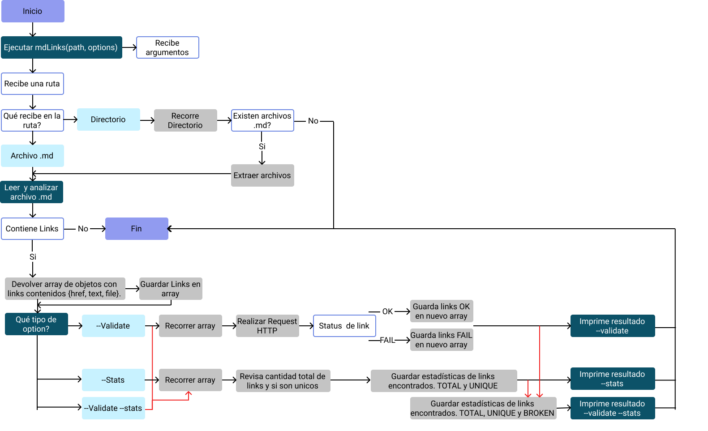
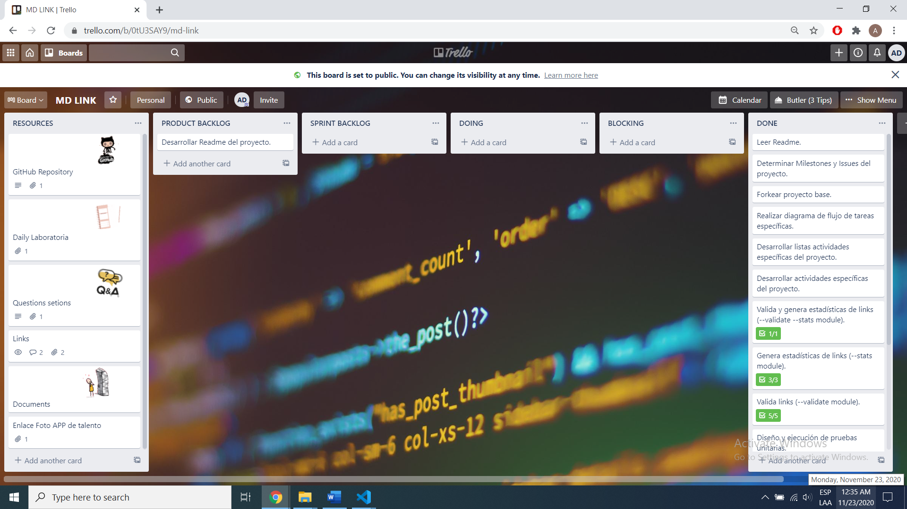
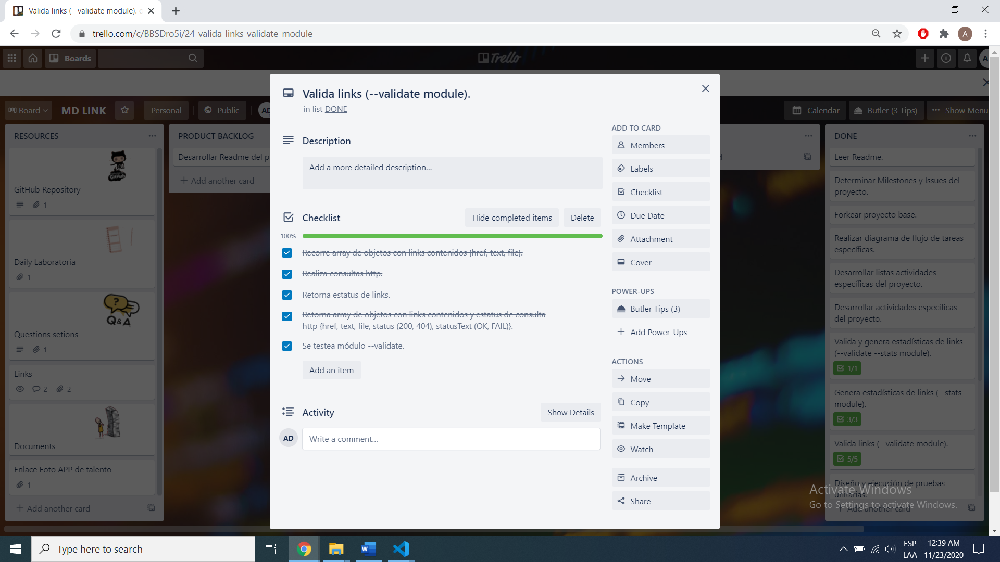
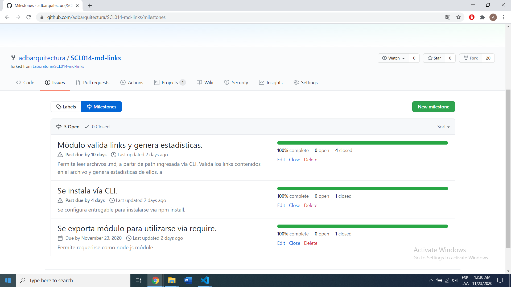

# Markdown Links


## Índice

* [1. Preámbulo](#1-preámbulo)
* [2. Resumen del proyecto](#2-resumen-del-proyecto)
* [3. Documentación Técnica](#3-documentación-Técnica)
* [4. Planificación y Desarrollo](#4-planificación-y-desarrollo)
* [5. Checklist](#5-checklist)

***

## 1. Preámbulo

[Markdown](https://es.wikipedia.org/wiki/Markdown) es un lenguaje de marcado
ligero muy popular entre developers. Es usado en muchísimas plataformas que
manejan texto plano (GitHub, foros, blogs, ...), y es muy común
encontrar varios archivos en ese formato en cualquier tipo de repositorio
(empezando por el tradicional `README.md`).

Estos archivos `Markdown` normalmente contienen _links_ (vínculos/ligas) que
muchas veces están rotos o ya no son válidos y eso perjudica mucho el valor de
la información que se quiere compartir.

Se crea una herramienta que lee y analiza archivos
en formato `Markdown`.

## 2. Resumen del proyecto

Librería desarrollada utilizando  [Node.js](https://nodejs.org/), permite leer y analizar archivos formato “Markdown”, para verificar los links que contenga y entregar algunas estadísticas. 

Se instala vía npm install, incluye ejecutable para ser requerido en la línea de comando, así  como una interfaz que puede importarse mediante require(‘md-links’) para usarlo programáticamente.


## 3. Documentación Técnica

### Instalación

#### node.js:
```js
$ npm install https://github.com/adbarquitectura/SCL014-md-links --save 
```

##### node.js global:
```js
$ npm install -g https://github.com/adbarquitectura/SCL014-md-links 
```

### Carga y configuración del módulo

#### JavaScript API
```js
const mdLinks = require('md-links');

mdLinks(path, options);
```
* path: string  
* option: Object

##### Argumentos

* `path`: Ruta de archivo o directorio.
* `options`: Un objeto con las siguientes propiedades:
  - `validate`: Booleano que determina si se desea validar los links encontrados.
  - `stats`: Booleano que entrega la estadística de los links
    encontrados.

##### Valor de retorno

Retornar una promesa (`Promise`) que resuelva a un arreglo
(`Array`) de objetos (`Object`), donde cada objeto representa un link y contiene
las siguientes propiedades:

* `href`: URL encontrada.
* `text`: Texto que aparecía dentro del link (`<a>`).
* `file`: Ruta del archivo donde se encontró el link.

#### Ejemplo

```js
const mdLinks = require("md-links");

mdLinks("./some/example.md")
  .then(links => {
    // => [{ href, text, file }]
  })
  .catch(console.error);

mdLinks("./some/example.md", { validate: true })
  .then(links => {
    // => [{ href, text, file, status, ok }]
  })
  .catch(console.error);

mdLinks("./some/dir")
  .then(links => {
    // => [{ href, text, file }]
  })
  .catch(console.error);

```

#### CLI (Command Line Interface - Interfaz de Línea de Comando)

```js
md-links <path-to-file> [options]
```

```js
npx md-links <path-to-file> [options]
```

#### Options

##### `--validate`

La opción `--validate`, realiza una petición HTTP para
averiguar si el link funciona o no. 

Por ejemplo:

```sh
$ md-links ./some/example.md --validate
./some/example.md http://algo.com/2/3/ ok 200 Link a algo
./some/example.md https://otra-cosa.net/algun-doc.html fail 404 algún doc
./some/example.md http://google.com/ ok 301 Google
```

##### `--stats`

La opción `--stats`, el output (salida) será un texto con estadísticas básicas sobre los links.

```sh
$ md-links ./some/example.md --stats
Total: 3
Unique: 3
```

Pu combinar `--stats` y `--validate` para obtener estadísticas que necesiten de los resultados de la validación.

```sh
$ md-links ./some/example.md --stats --validate
Total: 3
Unique: 3
Broken: 1
```


## 4. Planificación y Desarrollo

Este proyecto se realizó de manera individual, para el desarrollo de esta librería, se utilizaron diferentes herramientas de planificación y ejecución, partiendo desde la determinación de actividades generales, ordenadas en un [tablero](https://trello.com/b/0tU3SAY9) utilizando el **modelo canvas**, hasta determinar el **flujograma** según el requerimiento inicial. 

*Flujograma*






Igualmente se determinaron **milestones** e **issues** asociados a cada uno. 



## 5. Checklist

### General

* [X] Puede instalarse via `npm install --global <github-user>/md-links`

### `README.md`

* [X] Un board con el backlog para la implementación de la librería.
* [X] Documentación técnica de la librería.
* [X] Guía de uso e instalación de la librería

### API `mdLinks(path, opts)`

* [X] El módulo exporta una función con la interfaz (API) esperada.
* [X] Implementa soporte para archivo individual
* [X] Implementa soporte para directorios
* [X] Implementa `options.validate`

### CLI

* [X] Expone ejecutable `md-links` en el path (configurado en `package.json`)
* [X] Se ejecuta sin errores / output esperado
* [X] Implementa `--validate`
* [X] Implementa `--stats`

### Pruebas / tests

* [X] Pruebas unitarias cubren un mínimo del 70% de statements, functions,
  lines, y branches.
* [ ] Pasa tests (y linters) (`npm test`).